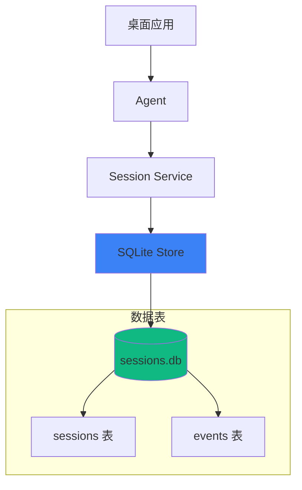

# SQLite 会话存储

SQLite 会话存储是 Aster 为桌面应用和单机场景提供的轻量级持久化方案，无需外部数据库服务。

## 🎯 为什么选择 SQLite？

| 特点 | 说明 |
|------|------|
| 🪶 **轻量级** | 无需外部数据库服务 |
| 📁 **单文件存储** | 所有数据存储在一个 `.db` 文件中 |
| ⚡ **高性能** | WAL 模式提供优秀的读写性能 |
| 🔒 **ACID 保证** | 完整的事务支持 |
| 🔄 **接口兼容** | 与 PostgreSQL/MySQL 使用相同接口 |

## 📊 架构设计



## 🚀 快速开始

### 安装依赖

SQLite 存储需要 CGO 支持：

```bash
# macOS (已内置 SQLite)
go get github.com/mattn/go-sqlite3

# Linux
sudo apt-get install libsqlite3-dev
go get github.com/mattn/go-sqlite3

# Windows (需要 GCC)
# 安装 MinGW-w64 后
go get github.com/mattn/go-sqlite3
```

### 基本使用

```go
import (
    "github.com/astercloud/aster/pkg/config"
    "github.com/astercloud/aster/pkg/session/sqlite"
)

// 使用标准数据目录
dbPath := config.DatabaseFile("sessions.db")
// macOS: ~/Library/Application Support/aster/sessions.db
// Linux: ~/.local/share/aster/sessions.db
// Windows: %LOCALAPPDATA%\aster\sessions.db

// 创建 SQLite 会话服务
service, err := sqlite.New(dbPath)
if err != nil {
    log.Fatal(err)
}
defer service.Close()
```

### 创建会话

```go
ctx := context.Background()

// 创建新会话
sess, err := service.Create(ctx, &session.CreateRequest{
    AppName: "my-desktop-app",
    UserID:  "user-123",
    AgentID: "agent-001",
    Metadata: map[string]any{
        "platform": runtime.GOOS,
        "version":  "1.0.0",
    },
})
if err != nil {
    log.Fatal(err)
}

fmt.Printf("会话 ID: %s\n", sess.ID())
```

### 添加消息

```go
// 用户消息
_, err = sess.AddEvent(ctx, session.AddEventOptions{
    Author:  "user",
    Content: "你好，请帮我分析代码",
})

// Agent 响应
_, err = sess.AddEvent(ctx, session.AddEventOptions{
    Author:    "assistant",
    Content:   "好的，我来帮你分析代码...",
    Reasoning: "用户请求代码分析，需要先理解代码内容",
    Actions: []session.Action{
        {
            ToolName: "Read",
            Input:    map[string]any{"path": "main.go"},
            Output:   "package main...",
        },
    },
})
```

### 查询历史

```go
// 遍历所有事件
for event := range sess.Events(ctx, &session.EventsOptions{}) {
    fmt.Printf("[%s] %s\n", event.Author(), event.Content())
}

// 获取最近 N 条事件
for event := range sess.Events(ctx, &session.EventsOptions{
    Limit: 10,
}) {
    fmt.Printf("%s: %s\n", event.Author(), event.Content())
}
```

### 会话管理

```go
// 列出所有会话
sessions, err := service.List(ctx, &session.ListRequest{
    AppName: "my-desktop-app",
    UserID:  "user-123",
})

for _, s := range sessions {
    fmt.Printf("- %s (Agent: %s)\n", s.ID(), s.AgentID())
}

// 获取特定会话
sess, err := service.Get(ctx, &session.GetRequest{
    AppName:   "my-desktop-app",
    UserID:    "user-123",
    SessionID: "session-id",
})

// 删除会话
err = service.Delete(ctx, &session.DeleteRequest{
    AppName:   "my-desktop-app",
    UserID:    "user-123",
    SessionID: "session-id",
})
```

## 📐 数据库结构

### sessions 表

```sql
CREATE TABLE sessions (
    id TEXT PRIMARY KEY,
    app_name TEXT NOT NULL,
    user_id TEXT NOT NULL,
    agent_id TEXT NOT NULL,
    metadata TEXT,  -- JSON 格式
    created_at DATETIME DEFAULT CURRENT_TIMESTAMP,
    updated_at DATETIME DEFAULT CURRENT_TIMESTAMP
);

CREATE INDEX idx_sessions_app_user ON sessions(app_name, user_id);
CREATE INDEX idx_sessions_updated ON sessions(updated_at DESC);
```

### events 表

```sql
CREATE TABLE events (
    id TEXT PRIMARY KEY,
    session_id TEXT NOT NULL,
    invocation_id TEXT,
    agent_id TEXT,
    branch TEXT,
    author TEXT,
    content TEXT,
    reasoning TEXT,
    actions TEXT,  -- JSON 格式
    long_running_tool_ids TEXT,
    metadata TEXT,  -- JSON 格式
    created_at DATETIME DEFAULT CURRENT_TIMESTAMP,
    FOREIGN KEY (session_id) REFERENCES sessions(id) ON DELETE CASCADE
);

CREATE INDEX idx_events_session ON events(session_id);
CREATE INDEX idx_events_created ON events(created_at);
```

## ⚙️ 配置选项

SQLite 使用 WAL (Write-Ahead Logging) 模式，提供更好的并发性能：

```go
// 连接字符串参数
// ?_journal_mode=WAL  - 启用 WAL 模式
// &_busy_timeout=5000 - 等待锁超时 5 秒

db, err := sql.Open("sqlite3", dbPath+"?_journal_mode=WAL&_busy_timeout=5000")
```

### WAL 模式优势

- ✅ 读写可以并发进行
- ✅ 写操作不阻塞读操作
- ✅ 更快的写入性能
- ✅ 更好的崩溃恢复

## 🔄 与其他存储的对比

| 特性 | SQLite | PostgreSQL | MySQL | Memory |
|------|--------|------------|-------|--------|
| 部署复杂度 | ⭐ 最简单 | ⭐⭐⭐ | ⭐⭐⭐ | ⭐ 最简单 |
| 数据持久化 | ✅ | ✅ | ✅ | ❌ |
| 并发性能 | ⭐⭐ | ⭐⭐⭐ | ⭐⭐⭐ | ⭐⭐⭐ |
| JSON 查询 | 基本支持 | JSONB | JSON | 原生 |
| 适用场景 | 桌面/单机 | 服务器 | 服务器 | 开发测试 |

## 💡 最佳实践

### 1. 使用标准路径

```go
import "github.com/astercloud/aster/pkg/config"

// 推荐：使用跨平台标准路径
dbPath := config.DatabaseFile("sessions.db")

// 不推荐：硬编码路径
// dbPath := "/Users/me/data/sessions.db"
```

### 2. 定期维护

```go
// 清理旧会话
func cleanupOldSessions(service *sqlite.Service, maxAge time.Duration) error {
    ctx := context.Background()
    sessions, _ := service.List(ctx, &session.ListRequest{
        AppName: "my-app",
        UserID:  "user-123",
    })

    cutoff := time.Now().Add(-maxAge)
    for _, sess := range sessions {
        if sess.UpdatedAt().Before(cutoff) {
            service.Delete(ctx, &session.DeleteRequest{
                AppName:   "my-app",
                UserID:    "user-123",
                SessionID: sess.ID(),
            })
        }
    }
    return nil
}
```

### 3. 备份数据

```bash
# SQLite 数据库可以直接复制
cp ~/.local/share/aster/sessions.db backup/sessions.db

# 或使用 sqlite3 命令
sqlite3 ~/.local/share/aster/sessions.db ".backup backup/sessions.db"
```

## 📚 相关文档

- [Session 持久化](/core-concepts/session-persistence) - PostgreSQL/MySQL 存储
- [跨平台路径](/deployment/desktop/paths) - 路径管理系统
- [桌面应用部署](/deployment/desktop) - 桌面框架集成

## 🔗 示例代码

完整示例请参考：

```bash
go run ./examples/session-sqlite/
```
