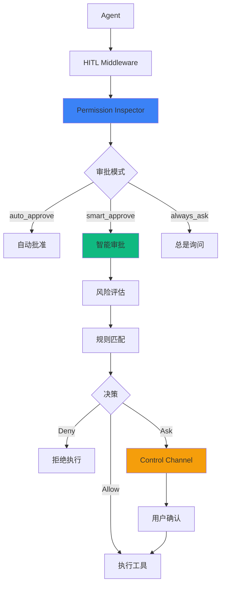

# Permission 权限系统

Permission 系统提供了灵活的工具执行权限控制，支持三种审批模式和基于规则的智能决策。

## 🎯 核心概念

### 三种审批模式

| 模式 | 说明 | 适用场景 |
|------|------|----------|
| `auto_approve` | 自动批准所有操作 | 开发测试、可信环境 |
| `smart_approve` | 根据风险级别智能决策 | **推荐默认模式** |
| `always_ask` | 所有操作都需确认 | 高安全性场景 |

### 风险级别

| 级别 | 工具示例 | 说明 |
|------|----------|------|
| **Low** | Read, List, Search | 只读操作，无副作用 |
| **Medium** | Write, Edit | 文件修改，有限范围 |
| **High** | Bash, Delete, Http | 系统命令，网络访问 |

## 📊 架构设计



## 🚀 快速开始

### 创建 Inspector

```go
import "github.com/astercloud/aster/pkg/permission"

// 使用智能审批模式（推荐）
inspector, err := permission.NewInspector(
    permission.WithMode(permission.ModeSmartApprove),
)
if err != nil {
    log.Fatal(err)
}
```

### 检查权限

```go
ctx := context.Background()

result, err := inspector.Check(ctx, &permission.Request{
    ToolName:  "Bash",
    Arguments: map[string]any{
        "command": "rm -rf /tmp/test",
    },
})

if result.NeedsApproval {
    // 需要用户确认
    fmt.Printf("需要审批: %s (风险: %s)\n", result.ToolName, result.RiskLevel)
} else if result.Decision == permission.DecisionAllow {
    // 自动批准
    fmt.Println("已批准执行")
} else {
    // 拒绝执行
    fmt.Printf("拒绝: %s\n", result.Reason)
}
```

## 🔧 审批模式详解

### Auto Approve 模式

```go
inspector, _ := permission.NewInspector(
    permission.WithMode(permission.ModeAutoApprove),
)

// 所有工具都自动批准
result, _ := inspector.Check(ctx, &permission.Request{
    ToolName: "Bash",
    Arguments: map[string]any{"command": "rm -rf /"},
})
// result.Decision == DecisionAllow
// result.NeedsApproval == false
```

::alert{type="warning"}
⚠️ Auto Approve 模式会批准所有操作，仅在开发测试或完全可信的环境中使用。
::

### Smart Approve 模式

```go
inspector, _ := permission.NewInspector(
    permission.WithMode(permission.ModeSmartApprove),
)

// 只读操作 - 自动批准
result, _ := inspector.Check(ctx, &permission.Request{
    ToolName: "Read",
    Arguments: map[string]any{"path": "main.go"},
})
// result.NeedsApproval == false

// 写操作 - 需要审批
result, _ = inspector.Check(ctx, &permission.Request{
    ToolName: "Write",
    Arguments: map[string]any{"path": "main.go", "content": "..."},
})
// result.NeedsApproval == true

// 系统命令 - 需要审批
result, _ = inspector.Check(ctx, &permission.Request{
    ToolName: "Bash",
    Arguments: map[string]any{"command": "echo hello"},
})
// result.NeedsApproval == true
```

### Always Ask 模式

```go
inspector, _ := permission.NewInspector(
    permission.WithMode(permission.ModeAlwaysAsk),
)

// 即使只读操作也需要确认
result, _ := inspector.Check(ctx, &permission.Request{
    ToolName: "Read",
    Arguments: map[string]any{"path": "main.go"},
})
// result.NeedsApproval == true
```

## 📝 规则系统

### 添加规则

```go
// 允许所有读取操作
inspector.AddRule(&permission.Rule{
    Pattern:   "Read",
    Decision:  permission.DecisionAllowAlways,
    RiskLevel: permission.RiskLevelLow,
    Note:      "允许所有读取操作",
})

// 禁止危险命令
inspector.AddRule(&permission.Rule{
    Pattern:   "Bash",
    Decision:  permission.DecisionDenyAlways,
    RiskLevel: permission.RiskLevelHigh,
    Conditions: []permission.Condition{
        {
            Field:    "command",
            Operator: "contains",
            Value:    "rm -rf",
        },
    },
    Note: "禁止危险的删除命令",
})

// 允许写入特定目录
inspector.AddRule(&permission.Rule{
    Pattern:   "Write",
    Decision:  permission.DecisionAllowAlways,
    Conditions: []permission.Condition{
        {
            Field:    "path",
            Operator: "prefix",
            Value:    "/tmp/",
        },
    },
    Note: "允许写入临时目录",
})
```

### 条件运算符

| 运算符 | 说明 | 示例 |
|--------|------|------|
| `eq` | 相等 | `command eq "ls"` |
| `ne` | 不等 | `path ne "/etc/passwd"` |
| `contains` | 包含 | `command contains "rm"` |
| `prefix` | 前缀 | `path prefix "/home/"` |
| `suffix` | 后缀 | `path suffix ".txt"` |
| `regex` | 正则 | `command regex "^git\s+"` |

### 临时规则

```go
// 创建临时规则（1小时后过期）
expiry := time.Now().Add(time.Hour)
inspector.AddRule(&permission.Rule{
    Pattern:   "Bash",
    Decision:  permission.DecisionAllowAlways,
    ExpiresAt: &expiry,
    Note:      "临时允许 Bash 命令",
})
```

### 规则持久化

```go
// 保存规则到文件
err := inspector.SaveRules()
// 规则保存到: ~/.config/aster/permissions.json

// 创建时自动加载规则
inspector, _ := permission.NewInspector(
    permission.WithMode(permission.ModeSmartApprove),
    permission.WithAutoLoad(true),  // 自动加载已保存的规则
)

// 自定义规则文件路径
inspector, _ := permission.NewInspector(
    permission.WithPath("/custom/path/permissions.json"),
)
```

## 🔗 与 Agent 集成

### 使用 HITL 中间件

```go
import (
    "github.com/astercloud/aster/pkg/middleware"
    "github.com/astercloud/aster/pkg/permission"
)

// 创建 Inspector
inspector, _ := permission.NewInspector(
    permission.WithMode(permission.ModeSmartApprove),
)

// 创建 HITL 中间件
hitlMiddleware := middleware.NewHumanInTheLoopMiddleware(&middleware.HumanInTheLoopMiddlewareConfig{
    Inspector: inspector,
    ApprovalHandler: func(ctx context.Context, req *middleware.ReviewRequest) ([]middleware.Decision, error) {
        // 自定义审批逻辑
        for _, action := range req.ActionRequests {
            fmt.Printf("需要审批: %s\n", action.ToolName)
            // 显示 UI 或命令行提示...
        }
        return []middleware.Decision{{Type: middleware.DecisionApprove}}, nil
    },
})

// 注册中间件
middleware.DefaultRegistry.Register("hitl", func(config *middleware.MiddlewareFactoryConfig) (middleware.Middleware, error) {
    return hitlMiddleware, nil
})

// 在 Agent 中使用
config := &types.AgentConfig{
    Middlewares: []string{"hitl"},
}
```

### Control Channel 集成

```go
// 订阅 Control Channel
controlCh := agent.Subscribe([]types.AgentChannel{types.ChannelControl}, nil)

go func() {
    for event := range controlCh {
        switch e := event.Event.(type) {
        case *types.ControlPermissionRequiredEvent:
            // 显示审批对话框
            approved := showApprovalDialog(e.ToolName, e.Arguments, e.RiskLevel)
            
            // 发送决定
            agent.RespondToPermission(e.RequestID, approved, "用户决定")
        }
    }
}()
```

## 📊 风险评估

### 内置风险规则

```go
// 获取工具风险级别
risk := inspector.AssessRisk(&permission.Request{
    ToolName:  "Bash",
    Arguments: map[string]any{"command": "curl http://..."},
})
// risk == RiskLevelHigh
```

### 风险评估因素

| 因素 | 低风险 | 高风险 |
|------|--------|--------|
| 工具类型 | Read, List | Bash, Delete |
| 目标路径 | 工作目录内 | 系统目录 |
| 命令内容 | 查询类 | 修改/删除类 |
| 网络访问 | 无 | 外部请求 |

## 💡 最佳实践

### 1. 分层权限策略

```go
// 开发环境
if env == "development" {
    inspector, _ = permission.NewInspector(
        permission.WithMode(permission.ModeAutoApprove),
    )
}

// 生产环境
if env == "production" {
    inspector, _ = permission.NewInspector(
        permission.WithMode(permission.ModeAlwaysAsk),
    )
}
```

### 2. 白名单优先

```go
// 添加安全工具白名单
safeTools := []string{"Read", "List", "Search", "Glob"}
for _, tool := range safeTools {
    inspector.AddRule(&permission.Rule{
        Pattern:  tool,
        Decision: permission.DecisionAllowAlways,
    })
}
```

### 3. 记录审批历史

```go
// 记录所有审批决定
inspector.OnDecision(func(req *permission.Request, result *permission.Result) {
    log.Printf("Permission: tool=%s decision=%s reason=%s",
        req.ToolName, result.Decision, result.Reason)
})
```

## 📚 相关文档

- [Human-in-the-Loop](/core-concepts/middleware#hitl) - HITL 中间件详解
- [Guardrails](/security/guardrails) - 安全防护系统
- [Recipe 权限配置](/guides/recipe#permission) - 在 Recipe 中配置权限

## 🔗 示例代码

```bash
# 运行 Permission 示例
go run ./examples/permission/

# 运行 Human-in-the-Loop 示例
go run ./examples/human-in-the-loop/
```
