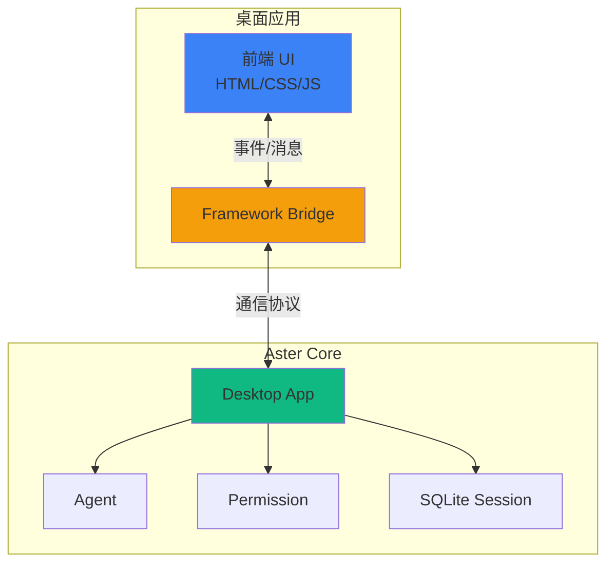

# 桌面应用部署

Aster 提供了完整的桌面应用支持，可以与 Wails、Tauri、Electron 等主流桌面框架集成。

## 🎯 支持的框架

| 框架 | 语言 | 通信方式 | 特点 |
|------|------|----------|------|
| **Wails** | Go | 直接函数调用 | 最高性能，Go 原生 |
| **Tauri** | Rust | HTTP + WebSocket | 轻量级，Rust 后端 |
| **Electron** | Node.js | HTTP + WebSocket | 成熟生态，跨平台 |

## 📊 架构设计



## 🚀 快速开始

### 安装依赖

```go
import "github.com/astercloud/aster/pkg/desktop"
```

### 创建桌面应用

```go
import (
    "context"
    "github.com/astercloud/aster/pkg/desktop"
    "github.com/astercloud/aster/pkg/permission"
)

func main() {
    ctx := context.Background()

    // 创建 Permission Inspector
    inspector, _ := permission.NewInspector(
        permission.WithMode(permission.ModeSmartApprove),
    )

    // 创建桌面应用
    app, err := desktop.NewApp(&desktop.Config{
        Framework:  desktop.FrameworkWails, // 或 FrameworkTauri, FrameworkElectron
        Inspector:  inspector,
        DataDir:    "", // 使用默认路径
    })
    if err != nil {
        log.Fatal(err)
    }

    // 启动应用
    if err := app.Start(ctx); err != nil {
        log.Fatal(err)
    }
}
```

## 🔧 框架集成

### Wails 集成

Wails 使用直接的 Go 函数绑定，性能最高：

```go
package main

import (
    "context"
    "github.com/astercloud/aster/pkg/desktop"
    "github.com/wailsapp/wails/v2"
)

func main() {
    app, _ := desktop.NewApp(&desktop.Config{
        Framework: desktop.FrameworkWails,
    })

    // 获取 Wails 绑定
    bridge := app.Bridge().(*desktop.WailsBridge)

    // Wails 应用配置
    err := wails.Run(&options.App{
        Title:  "Aster Desktop",
        Width:  1024,
        Height: 768,
        Bind: []interface{}{
            bridge, // 绑定 Aster 方法
        },
    })
}
```

**前端调用 (JavaScript):**

```javascript
// 发送消息
const response = await window.go.desktop.WailsBridge.SendMessage(agentId, message);

// 创建 Agent
const agentId = await window.go.desktop.WailsBridge.CreateAgent(config);

// 获取历史
const messages = await window.go.desktop.WailsBridge.GetHistory(agentId);
```

### Tauri 集成

Tauri 使用 HTTP + WebSocket 通信：

```go
package main

import (
    "context"
    "github.com/astercloud/aster/pkg/desktop"
)

func main() {
    app, _ := desktop.NewApp(&desktop.Config{
        Framework: desktop.FrameworkTauri,
        HTTPPort:  8765, // HTTP 端口
        WSPort:    8766, // WebSocket 端口
    })

    // 启动服务
    app.Start(context.Background())

    // Tauri 前端通过 HTTP/WS 连接
}
```

**前端调用 (TypeScript):**

```typescript
// HTTP 请求
const response = await fetch('http://localhost:8765/api/agent/send', {
    method: 'POST',
    body: JSON.stringify({ agent_id: agentId, message: message })
});

// WebSocket 事件流
const ws = new WebSocket('ws://localhost:8766/ws');
ws.onmessage = (event) => {
    const data = JSON.parse(event.data);
    if (data.type === 'text_chunk') {
        appendText(data.delta);
    }
};
```

### Electron 集成

Electron 与 Tauri 类似，使用 HTTP + WebSocket：

```go
package main

import (
    "context"
    "github.com/astercloud/aster/pkg/desktop"
)

func main() {
    app, _ := desktop.NewApp(&desktop.Config{
        Framework: desktop.FrameworkElectron,
        HTTPPort:  8765,
        WSPort:    8766,
    })

    app.Start(context.Background())
}
```

**Electron 主进程:**

```javascript
const { app, BrowserWindow } = require('electron');
const { spawn } = require('child_process');

let asterProcess;

app.whenReady().then(() => {
    // 启动 Aster 后端
    asterProcess = spawn('./aster-desktop');

    // 创建窗口
    const win = new BrowserWindow({
        width: 1024,
        height: 768,
        webPreferences: {
            nodeIntegration: true
        }
    });

    win.loadFile('index.html');
});

app.on('quit', () => {
    asterProcess.kill();
});
```

## 📡 API 接口

### HTTP API

| 端点 | 方法 | 说明 |
|------|------|------|
| `/api/agent/create` | POST | 创建 Agent |
| `/api/agent/send` | POST | 发送消息 |
| `/api/agent/status` | GET | 获取状态 |
| `/api/agent/history` | GET | 获取历史 |
| `/api/agent/close` | POST | 关闭 Agent |
| `/api/permission/approve` | POST | 审批权限请求 |

### WebSocket 事件

```typescript
interface WSEvent {
    type: 'text_chunk' | 'tool_start' | 'tool_end' | 'permission_required' | 'error';
    agent_id: string;
    data: any;
}

// 文本输出
{ type: 'text_chunk', agent_id: 'xxx', data: { delta: 'Hello' } }

// 工具开始
{ type: 'tool_start', agent_id: 'xxx', data: { tool: 'Read', args: {...} } }

// 工具结束
{ type: 'tool_end', agent_id: 'xxx', data: { tool: 'Read', result: '...' } }

// 权限请求
{ type: 'permission_required', agent_id: 'xxx', data: { request_id: 'xxx', tool: 'Bash', risk: 'high' } }
```

## 💾 数据存储

### 跨平台路径

```go
import "github.com/astercloud/aster/pkg/config"

// 配置目录
configDir := config.ConfigDir()
// macOS: ~/Library/Application Support/aster/
// Linux: ~/.config/aster/
// Windows: %APPDATA%\aster\

// 数据库文件
dbPath := config.DatabaseFile("sessions.db")
// macOS: ~/Library/Application Support/aster/sessions.db

// 日志目录
logDir := config.LogDir()
// macOS: ~/Library/Logs/aster/
```

### SQLite 会话

```go
import "github.com/astercloud/aster/pkg/session/sqlite"

// 创建 SQLite 存储
dbPath := config.DatabaseFile("sessions.db")
store, _ := sqlite.New(dbPath)

// 在 Desktop App 中使用
app, _ := desktop.NewApp(&desktop.Config{
    SessionStore: store,
})
```

## 🔐 权限管理

### 集成 Permission 系统

```go
import "github.com/astercloud/aster/pkg/permission"

inspector, _ := permission.NewInspector(
    permission.WithMode(permission.ModeSmartApprove),
    permission.WithPath(config.ConfigFile("permissions.json")),
)

app, _ := desktop.NewApp(&desktop.Config{
    Inspector: inspector,
})
```

### 前端权限 UI

```typescript
// 监听权限请求
ws.onmessage = (event) => {
    const data = JSON.parse(event.data);
    if (data.type === 'permission_required') {
        showPermissionDialog(data.data);
    }
};

// 发送审批决定
async function approvePermission(requestId: string, approved: boolean) {
    await fetch('http://localhost:8765/api/permission/approve', {
        method: 'POST',
        body: JSON.stringify({
            request_id: requestId,
            approved: approved,
            remember: true // 记住决定
        })
    });
}
```

## 📦 打包分发

### Wails 打包

```bash
# 构建 macOS 应用
wails build -platform darwin/universal

# 构建 Windows 应用
wails build -platform windows/amd64

# 构建 Linux 应用
wails build -platform linux/amd64
```

### Tauri 打包

```bash
# 构建所有平台
npm run tauri build

# 指定平台
npm run tauri build -- --target x86_64-apple-darwin
```

### Electron 打包

```bash
# 使用 electron-builder
npm run build

# 指定平台
npm run build -- --mac --win --linux
```

## 💡 最佳实践

### 1. 框架选择

| 场景 | 推荐框架 | 原因 |
|------|----------|------|
| Go 技术栈 | Wails | 原生集成，性能最佳 |
| 最小体积 | Tauri | Rust 后端，体积小 |
| 丰富生态 | Electron | npm 生态，插件多 |

### 2. 性能优化

```go
// 使用流式输出
app.OnStreamChunk(func(agentID, chunk string) {
    // 实时更新 UI
})

// 缓存会话数据
app.EnableSessionCache(100) // 缓存 100 条消息
```

### 3. 安全考虑

```go
// 生产环境使用严格权限
inspector, _ := permission.NewInspector(
    permission.WithMode(permission.ModeSmartApprove),
)

// 限制工具访问
config := &desktop.Config{
    AllowedTools: []string{"Read", "Search", "Write"},
    // 不允许 Bash
}
```

## 📚 相关文档

- [SQLite 会话存储](/core-concepts/session-sqlite) - 本地数据存储
- [Permission 系统](/security/permission) - 权限管理
- [跨平台路径](/deployment/desktop/paths) - 路径管理

## 🔗 示例代码

```bash
# 运行桌面示例
go run ./examples/desktop/

# 查看示例 README
cat examples/desktop/README.md
```
